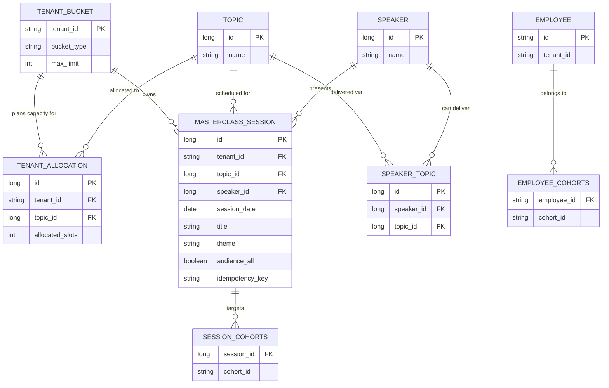

# Data Model — Emeritus Edge Masterclass Scheduling

## Overview

The schema splits into two zones:

| Zone | Tables | Scoped by tenant? |
|------|--------|-------------------|
| **Global catalogue** | `topic`, `speaker`, `speaker_topic` | No — shared reference data |
| **Tenant data** | `tenant_bucket`, `tenant_allocation`, `masterclass_session`, `session_cohorts`, `employee`, `employee_cohorts` | Yes — every query filters on `tenant_id` |

---

## Entity Relationship Diagram



---

## Table Definitions

### Global catalogue (no `tenant_id`)

#### `topic`
| Column | Type | Notes |
|--------|------|-------|
| `id` | BIGINT | PK — seeded catalogue (8 topics) |
| `name` | VARCHAR | e.g. "AI Strategy for Leaders" |

#### `speaker`
| Column | Type | Notes |
|--------|------|-------|
| `id` | BIGINT | PK |
| `name` | VARCHAR | e.g. "Dr. Sarah Jenkins" |

#### `speaker_topic`
| Column | Type | Notes |
|--------|------|-------|
| `id` | BIGINT | PK |
| `speaker_id` | BIGINT | FK → `speaker.id` |
| `topic_id` | BIGINT | FK → `topic.id` |

**Unique:** `(speaker_id, topic_id)` — a speaker can deliver a topic only once in the roster.

---

### Tenant-scoped tables

#### `tenant_bucket`
Commercial SKU limit per customer.

| Column | Type | Notes |
|--------|------|-------|
| `tenant_id` | VARCHAR | PK — e.g. `vantage-fi` |
| `bucket_type` | VARCHAR | `BUCKET_01` / `BUCKET_02` / `BUCKET_03` |
| `max_limit` | INT | Max scheduled sessions per year: 1 / 3 / 8 |

#### `tenant_allocation`
L&D distributes bucket slots across topics (Step 1).

| Column | Type | Notes |
|--------|------|-------|
| `id` | BIGINT | PK |
| `tenant_id` | VARCHAR | FK → `tenant_bucket.tenant_id` |
| `topic_id` | BIGINT | FK → `topic.id` |
| `allocated_slots` | INT | How many sessions planned for this topic |

**Unique:** `(tenant_id, topic_id)`  
**Rule:** `SUM(allocated_slots)` per tenant ≤ `tenant_bucket.max_limit`

#### `masterclass_session`
A scheduled masterclass (Step 2).

| Column | Type | Notes |
|--------|------|-------|
| `id` | BIGINT | PK |
| `tenant_id` | VARCHAR | FK → `tenant_bucket.tenant_id` |
| `topic_id` | BIGINT | FK → `topic.id` |
| `speaker_id` | BIGINT | FK → `speaker.id` (must exist in `speaker_topic`) |
| `session_date` | DATE | Must be ≥ 14 days in future at schedule time |
| `title` | VARCHAR | Session title |
| `theme` | VARCHAR | Session theme |
| `audience_all` | BOOLEAN | `true` = whole tenant invited |
| `idempotency_key` | VARCHAR | Client-supplied idempotency token |

**Unique:** `(tenant_id, idempotency_key)`  
**Index:** `(tenant_id, session_date)` — invitation read pattern  
**Rules:**
- Count per `(tenant_id, topic_id)` ≤ `tenant_allocation.allocated_slots`
- Count per `tenant_id` ≤ `tenant_bucket.max_limit`

#### `session_cohorts`
Target cohorts when `audience_all = false`.

| Column | Type | Notes |
|--------|------|-------|
| `session_id` | BIGINT | FK → `masterclass_session.id` |
| `cohort_id` | VARCHAR | e.g. `leadership-2026` |

**Audience rule (XOR):** either `audience_all = true` and no rows here, OR `audience_all = false` and at least one cohort row.

#### `employee`
| Column | Type | Notes |
|--------|------|-------|
| `id` | VARCHAR | PK — e.g. `emp-001` |
| `tenant_id` | VARCHAR | FK → `tenant_bucket.tenant_id` |

#### `employee_cohorts`
| Column | Type | Notes |
|--------|------|-------|
| `employee_id` | VARCHAR | FK → `employee.id` |
| `cohort_id` | VARCHAR | Cohort membership |

---

## Two-level cap (how tables interact)

```
tenant_bucket.max_limit = 3          ← Level 1: commercial bucket cap
        │
        ├── tenant_allocation        ← L&D planning distribution
        │     topic 1 → 2 slots
        │     topic 2 → 1 slot
        │     (total allocated = 3)
        │
        └── masterclass_session      ← Actual bookings
              topic 1 → 2 scheduled  ← Level 2: per-topic cap
              topic 2 → 1 scheduled
              (total scheduled = 3)
```

---

## Invitation read pattern

**Query path for `GET /v1/employees/{id}/upcoming-sessions`:**

```
employee
  → employee_cohorts (cohort list)
  → masterclass_session WHERE tenant_id = ?
      AND session_date >= today
      AND (
            audience_all = true
         OR session_id IN session_cohorts WHERE cohort_id IN (employee cohorts)
      )
```

**Product choice:** current cohort membership (not point-in-time snapshot).

**At scale:** add index on `session_cohorts(cohort_id)`; consider denormalized `session_invitation` table fed by events.

---

## Key design decisions

| Decision | Why |
|----------|-----|
| `tenant_id` on every tenant-owned row | Row-level multi-tenancy — simple for mid-market scale |
| `topic` / `speaker` global | Brief treats them as shared catalogue |
| `speaker_topic` join table | Enforces "speaker can only deliver listed topics" |
| `session_cohorts` as collection table | Flexible cohort targeting without a full cohort master table |
| `idempotency_key` on session | Safe retries without duplicate bookings |
| No FK constraints in JPA to `topic`/`speaker` | Logical FKs via IDs; catalogue is reference data |

---

## Sample data relationships

```
vantage-fi (BUCKET_02, max=3)
  ├── allocation: topic 1 → 2 slots
  ├── session: topic 1, speaker 1, audience_all=true
  └── employee emp-001 → cohorts [leadership-2026, managers-q2]

speaker 1 → topics [1, 4]
speaker 2 → topics [2, 3]
```
