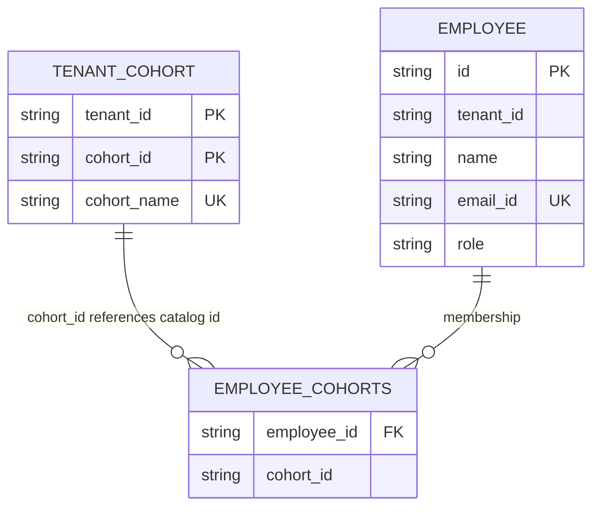

# Data Model — Round 2 CSV Upload

Schema changes for employee/cohort CSV upload (Round 2). Round 1 tables are unchanged except where noted below.  
Full Round 1 reference: **[SCHEMA.md](SCHEMA.md)**.

---

## Overview

| Change | Table | Why |
|--------|-------|-----|
| **New** | `tenant_cohort` | CSV uses cohort **display names**; need tenant catalog name → `cohort_id` |
| **Extended** | `employee` | CSV has `name`, `email`, `role` for CREATE/UPDATE reconcile |
| **Unchanged** | `employee_cohorts` | Still stores membership by `cohort_id`; reconcile diffs against CSV names via catalog |

All Round 2 upload queries filter by **`tenant_id`**.

---

## Entity relationship (Round 2 slice)

**Note:** `employee_cohorts.cohort_id` is not a formal FK to `tenant_cohort` in JPA/H2, but reconcile resolves ids through the tenant catalog.

---

## Table: `tenant_cohort` (new)

Cohort master **per tenant**. L&D Admin creates cohorts in the product; CSV rows reference **`cohort_name`**.

| Column | Type | Constraints | Description |
|--------|------|-------------|-------------|
| `tenant_id` | VARCHAR | PK (composite) | Tenant scope |
| `cohort_id` | VARCHAR | PK (composite) | Stable id used in `employee_cohorts` |
| `cohort_name` | VARCHAR | UNIQUE (`tenant_id`, `cohort_name`) | Display name matched to CSV `cohort_names` tokens |

**JPA entity:** `TenantCohort` (`@IdClass(TenantCohortId)`)

**Reconcile usage:** load all rows for tenant → map `cohort_name` → `cohort_id`.

---

## Table: `employee` (extended)

Round 1 had `id`, `tenant_id`, and cohort membership via collection. Round 2 adds profile fields for upload reconcile.

| Column | Type | Constraints | Round 2 |
|--------|------|-------------|---------|
| `id` | VARCHAR | PK | unchanged — maps to CSV `employee_id` |
| `tenant_id` | VARCHAR | | unchanged |
| `name` | VARCHAR | | **added** |
| `email_id` | VARCHAR | UNIQUE (global) | **added** |
| `role` | VARCHAR | nullable | **added** |

**JPA entity:** `Employee`

**Reconcile usage:** load employees whose `id` appears in CSV (`findAllById`), filtered by `tenant_id`; compare name, email, role, cohort membership.

---

## Table: `employee_cohorts` (unchanged)

| Column | Type | Description |
|--------|------|-------------|
| `employee_id` | VARCHAR | FK → `employee.id` |
| `cohort_id` | VARCHAR | References id from `tenant_cohort` for that tenant |

**JPA:** `@ElementCollection` on `Employee.cohortIds`

**Reconcile usage:** existing membership compared to CSV cohort names (via catalog) for ADD/REMOVE operations in preview.

---

## Seed data (`data.sql`, tenant `vantage-fi`)

### Employees (extended columns populated)

| id | tenant_id | name | email_id | role |
|----|-----------|------|----------|------|
| emp-001 | vantage-fi | Jane Doe | jane@vantage.com | EMPLOYEE |
| emp-002 | vantage-fi | Alex Chen | alex@vantage.com | EMPLOYEE |

### `employee_cohorts`

| employee_id | cohort_id |
|-------------|-----------|
| emp-001 | leadership-2026 |
| emp-001 | managers-q2 |
| emp-002 | engineering |

### `tenant_cohort`

| tenant_id | cohort_id | cohort_name |
|-----------|-----------|-------------|
| vantage-fi | leadership-2026 | Senior Leadership |
| vantage-fi | ai-capability-build | AI Capability Build |
| vantage-fi | managers-q2 | Managers Q2 |
| vantage-fi | engineering | Engineering |

---

## Repositories

| Repository | Key methods | Used by reconcile |
|------------|-------------|-------------------|
| `TenantCohortRepository` | `findByTenantId`, `findByTenantIdAndCohortName` | Catalog load |
| `EmployeeRepository` | `findAllById`, `findByIdAndTenantId`, `findByTenantId` | Targeted load by CSV ids |

---

## CSV → database mapping (reconcile read path)

| CSV column | Maps to |
|------------|---------|
| `employee_id` | `employee.id` |
| `email` | `employee.email_id` |
| `name` | `employee.name` |
| `role` | `employee.role` |
| `cohort_names` (semicolon list) | names in `tenant_cohort` → ids in `employee_cohorts` |
| `start_date` | not persisted in Phase 1 preview |
